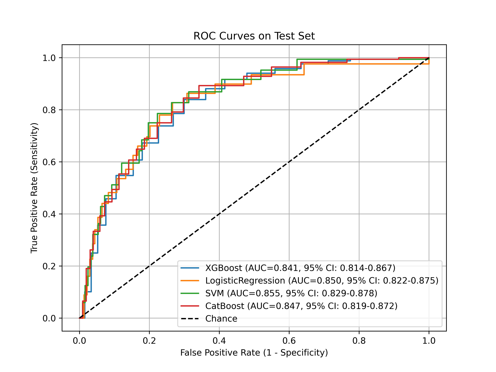

# Postoperative Stroke Prediction in Coronary Artery Disease (MIMIC-IV)

Code and experiments for the paper:

- **Machine Learning-Based Model for Postoperative Stroke Prediction in Coronary Artery Disease**  
  *Haonan Pan, Shuheng Chen, Elham Pishgar, Kamiar Alaei, Greg Placencia, Maryam Pishgar*  
  arXiv:2503.11973

Links: https://arxiv.org/abs/2503.11973`

---

## Overview

This repository builds and evaluates machine-learning models to predict **postoperative stroke** among **coronary artery disease (CAD)** patients undergoing **coronary revascularization** (PCI and/or CABG) using **MIMIC-IV** ICU data.

The pipeline includes:
- preprocessing (missingness handling, encoding, scaling, correlation filtering),
- feature selection (LASSO),
- class-imbalance handling
- model training + hyperparameter tuning,
- evaluation (AUROC + sensitivity/specificity/accuracy),
- interpretability (SHAP).

---

## Key Results (Test Set)

| Model | AUROC (95% CI) | Sensitivity | Specificity | Accuracy (95% CI) |
|---|---:|---:|---:|---:|
| XGBoost | 0.841 (0.814–0.867) | 0.500 | 0.908 | 0.875 (0.861–0.889) |
| Logistic Regression | 0.850 (0.822–0.875) | 0.685 | 0.817 | 0.807 (0.790–0.823) |
| **SVM (RBF)** | **0.855 (0.829–0.878)** | **0.720** | 0.817 | 0.809 (0.792–0.826) |
| CatBoost | 0.847 (0.819–0.872) | 0.429 | 0.932 | 0.892 (0.878–0.905) |

### ROC Curves
>
